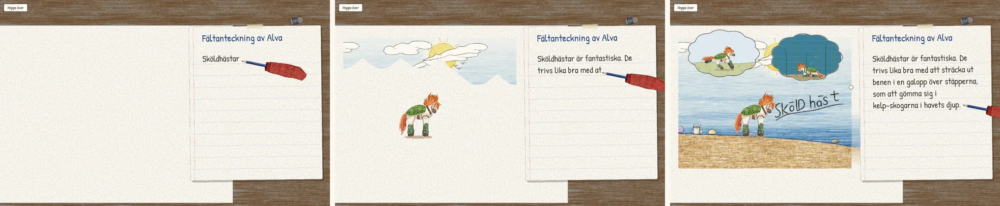
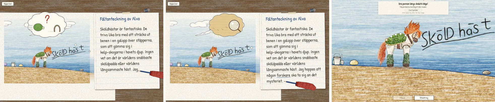
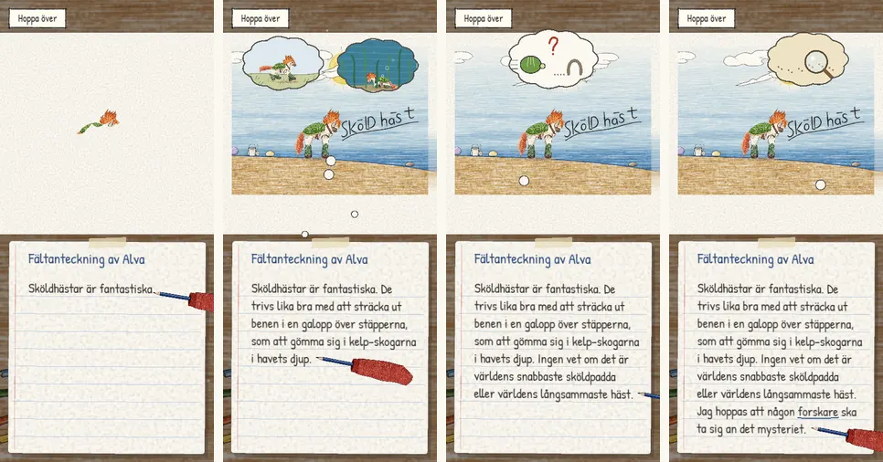
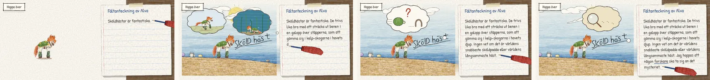

# The opening begins in Alva's head

Pappa: Alva's own note should open the game and set the scene, so the player
understands they are inside her thoughts; then, exactly as she imagines it, the
horse comes to life and the professor appears.

## What the player sees

1. **Into her head.** The room dims; a caption says *"Alva tänker på sin
   sköldhäst …"*. Dust drifts in warm light over a blank page. Her notebook card
   slides in, headed *"Fältanteckning av Alva"* (the same page as in the journal).
2. **Her words, in her handwriting, by her pencil.** The red-sleeved hand with
   the blue pencil (already in the art) writes her four sentences in the
   handwriting font, word by word, with pencil sounds. Her hand rests below the
   line, as a right-handed writer's does.
3. **Her words become pictures.** Each image appears as the pencil finishes its
   word:
   - *"Sköldhästar"*: the sköldhäst is coloured in on the blank page;
   - *"fantastiska"*: sparkles around it;
   - *"trivs"*: her beach, sea and sky colour in around it, with the margin;
   - *"stäpperna"*: a thought bubble rises from her words: a sköldhäst galloping
     over silver-green steppe, grass rushing past;
   - *"kelp-skogarna"*: a second bubble: deep water, swaying kelp, a sköldhäst
     hiding under its shell, bubbles rising;
   - *"sköldpadda"*: a bubble with a racing turtle shell, a creeping horseshoe
     and a big red *?* (the world's fastest turtle or slowest horse);
   - *"forskare"*: the word is underlined, a bubble shows a magnifying glass
     over little crab tracks, and a few grains of sand hop behind the horse,
     where Klo is still asleep.
4. **Out of her head, into her picture.** Her notebook slides away, the room
   brightens, and the camera goes into her picture while the caption says
   *"Precis som Alva tänker sig den. Alldeles stilla – än så länge."* The player
   wakes the sköldhäst with the shell stroke; it stamps and its wave arrives.
   Just before Klo wakes, her last sentence returns as a caption:
   *"Jag hoppas att någon forskare ska ta sig an det mysteriet."* The drop falls,
   and the researcher she hoped for comes up out of the sand.

Tapping or Enter hurries her pencil; *Hoppa över* (or Esc) goes straight to her
picture, for anyone starting a second game. Reduced motion writes each sentence
at once, with no pencil movement, drifting dust or camera moves, and keeps every
image in the same order.

## How it is built

- `src/opening-notes.mjs`: the dim, her card (paper, rules, red margin, tape),
  handwriting that is wrapped once and revealed character by character (no
  re-wrapping jumps), her pencil, drifting motes, thought bubbles with pencil
  trails and cloud-clipped vignettes (the real hero rig galloping and hiding),
  sparkles, and a pencil "colouring in" mask reveal. The card fits her whole
  note at the largest handwriting that fits: beside her picture in landscape,
  under it in portrait. Pure helpers are tested in `tests/skoldhast-opening-notes.test.mjs`.
- `src/prologue.mjs` (`playNotes`): the story beats, the framing of her picture
  beside the card, the word cues, hurry/skip input (cleaned up on close), and the
  hand-over to the existing awakening. New phases `notes` and `notes-end`.
- Her words come from `HER_TEXT` (`sv.mjs`); if they were ever removed, the
  journal's paraphrase is used instead.

## Checks

`tests/browser/skoldhast-notes.mjs` plays the whole note at 844×390, at 390×844
with tapping, and with reduced motion: her note is written out word for word,
one sentence after another; the four bubbles appear in order; the sköldhäst is
hidden until she writes about it and fully drawn before it wakes; the skip
button appears and is removed; both captions appear; skipping reaches the
picture quickly; closing during her note leaves nothing behind. The other
browser checks that start a new game skip her note.
