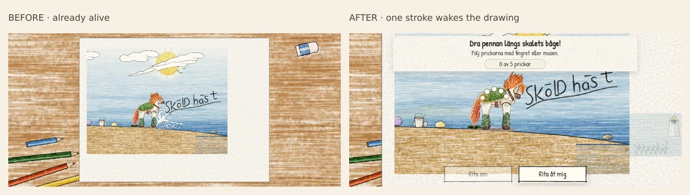
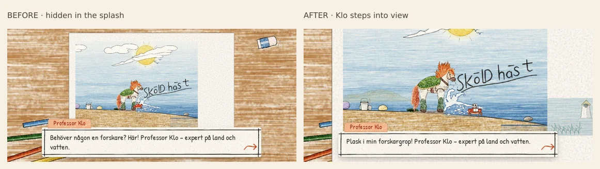
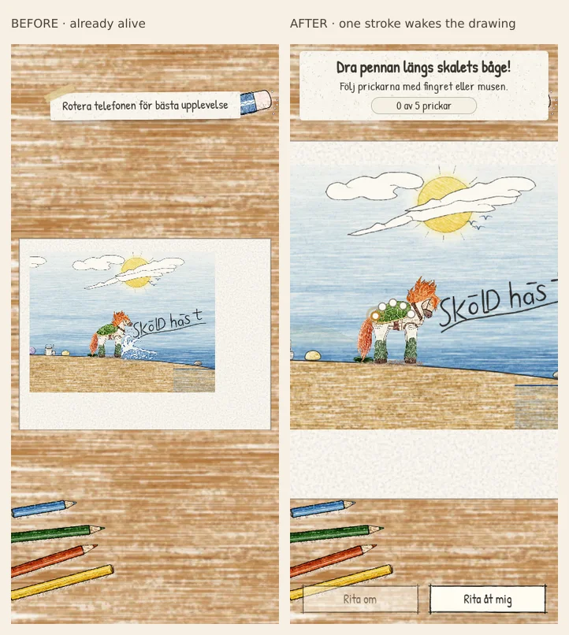
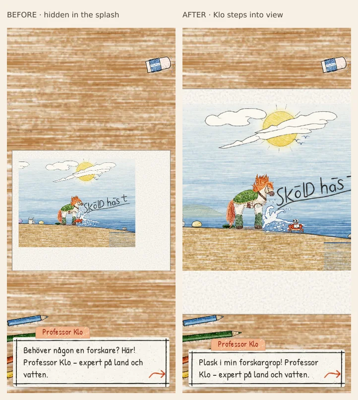
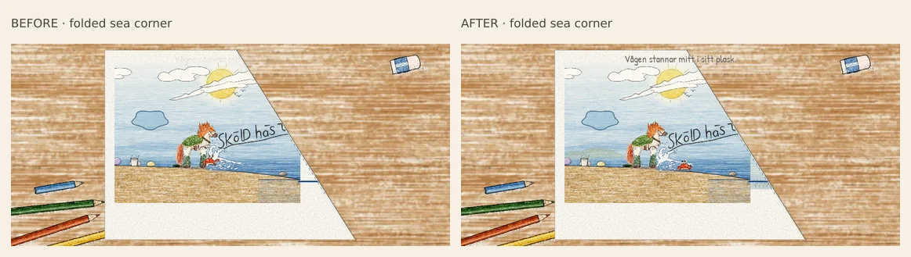
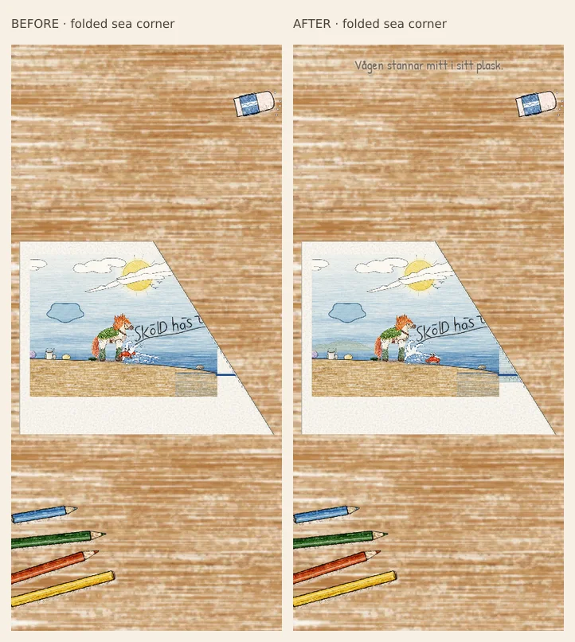

# Living opening: from Alva's pencil to the first mystery

Design and acceptance notes for `codex/skoldhast-living-opening`, based on main
`3896886`. This records the opening's design, code audit and before/after review.
Implementation and verification results are recorded below.

## Baseline findings

The baseline `npm test` run passes all 141 tests, including the full-game robot.
The following observations come from source, not a fresh-player comprehension
test:

| Existing behaviour | Consequence for the opening |
| --- | --- |
| `prologue.mjs` starts the live hero rig and splash before the first drawing action. | The player meets an already living creature; their pencil does not visibly wake it. |
| Klo appears by stretching a single sprite vertically. | His entrance has no physical preparation or reaction to the creature beside him. |
| The gull flies and the coloured cloud settles in the retained sky. | These already provide useful, persistent evidence that Alva's marks belong in this world. |
| The ruler crosses the new shoreline and a hinged paper corner carries the sea underneath. | The fold has a readable physical cause. Preserve its exact endpoint, intact lettering and retained shoreline. |
| The declared prologue `sun` is never assigned. | The existing update branch does not demonstrate moving rays stopping. Any such claim needs a real live overlay. |
| The opening answer explains underwater motion before the player investigates it. | Klo knows more than this scene has established. Describe the visible fold instead. |
| The distant places and the ruler share no staged visual cue. | The chapter's ridge, kelp forest and tower can feel like later additions rather than parts of this coastline. |
| The playable beach separately positions Klo for the stopwatch lesson. | The final prologue pose needs a deliberate handoff so he does not appear to enter twice. |

## Intended sequence

The emotional order is authorship, delight, companionship, interruption,
curiosity and resolve. Each reaction follows an action the player can see.

1. **A still drawing.** Present the existing, faithful Sköldhäst illustration on
   warm paper. Breathing, blinking, mane movement and idle shifts remain still.
   The short caption names Alva's creature without quoting unapproved text.
2. **A small mark wakes it.** A short, forgiving guided accent follows the
   existing shell arc. This is an added pencil accent, not a redesign of Alva's
   animal. The stroke completes, then breath, blink, head lift and a small hoof
   splash appear in sequence. Keyboard/example completion receives the same
   response. This adds one brief action before the existing three drawings.
3. **The splash wakes a neighbour.** A drop reaches Klo's sand mound. Eye stalks
   peer out, a claw braces, and the articulated crab emerges, lands sideways and
   gathers his composure. His first words react to the plask before he introduces
   his grand research credentials. The existing crab punchline still follows.
4. **The pencil's world grows.** Retain the gull and coloured-cloud drawings and
   their saved marks. The hero's gaze follows their motion. A distant grassy
   ridge, kelp under the water and a paper tower sit on the same coastline; they
   invite recognition later without naming destinations or teaching solutions.
5. **The shoreline attracts attention.** The hero asks for the next wave on its
   hooves. As the player extends the shore, a tiny measuring silhouette or light
   shifts by the tower. The ruler approaches from that direction. Allow time to
   see the connection before the fold moves.
6. **A visible interruption.** Preserve the physical sea fold and the exact
   interrupted stroke. The wave stops when the paper folds, not before. A hoof
   testing the stopped splash makes the loss tangible. Characters and the new
   cloud remain alive; underwater detail can keep moving quietly.
7. **A mystery the player owns.** “Vad hände?” describes the sea beneath the
   paper and the interrupted wave and stroke. “Vem gjorde så?” reports a shadow
   and ruler, without naming their owner. The hero wants the plask back and
   chooses to follow the clues. The camera enters the familiar beach.

Keep one focal event at a time. The new shell accent should be brief enough that
the opening still feels like entering a story, with drawing and dialogue paced
by the player. Reduced motion keeps the same causes, order and readable pauses.

## What the environment tells us, and what it withholds

The ridge, kelp and tower are connected parts of one coast. The ruler and crease
are an observable trail. The tower's opening light is a glimpse or measuring
cue, not the restored working lamp: P7 must still have a lamp to light.

The opening does not name the shadow, explain the keeper's fear or imply that
Alva drew badly. His protective but mistaken motive and apology belong to
Kapitel 3. The interrupted shore is allowed to be unfinished; it will become
the line the player completes in the finale.

Only the waves and sun stop. People, the gull, the cloud and underwater currents
are not frozen. A moving kelp ribbon or bubble may invite a question, but Klo
does not state the entire underwater rule before its discovery. The map corner
demonstration, still-water reflection, galloping over dashes and riding currents
inside the shell retain their existing playable introductions.

## Implementation boundaries

- Reuse `createKlo` and the hero rig; stage them in the prologue's paper space
  while respecting the rigs' world-space look and foot coordinates.
- Keep the tested fold geometry, exact shoreline endpoint and blank paper
  reverse. Do not mirror lettering.
- Put every player-facing line and prompt in `src/content/sv.mjs`. `HER_TEXT`
  stays null; use only Alva's first name. Add no photos, scans or speech synthesis.
- Prefer bounded pencil graphics, existing textures and transforms. Avoid heavy
  filters and loading later chapters' art for the opening. The measured first
  playable must remain below 3,000,000 bytes.
- Reconcile the final Klo position with `story.mjs`'s `k1_enter` beat. Gallop and
  hiding remain player-controlled lessons, followed by the map demonstration.
- Every new awaited animation must respect cancellation, reopening and reduced
  motion. Do not let an abandoned opening animate the next session.

## Acceptance review

The following are checks to perform, not results already obtained:

- Record the still hero, completed shell accent, wake reaction, Klo anticipation
  and emergence, shoreline attention, ruler, mid-fold and final question at
  844×390, 390×844 and 1440×900. Compare the same beats with the baseline.
- Verify that the hero stays still until the accent completes; the splash
  precedes Klo's reaction; the ruler precedes the fold; and the wave freezes at
  the fold. Confirm the sun visually if live rays are implemented.
- Confirm the player can follow the accent using touch, mouse and keyboard
  fallback. The native touch target and drawing guide must fit both phone
  orientations without obscuring the creature's response.
- Verify the existing gull and coloured cloud retain their chosen shape and
  colour across drawing, scene entry and save restoration.
- Check reduced motion and interruption/reopen during the wake, crab emergence
  and fold. No stale callbacks, detached particles or duplicate dialogue.
- Run `npm test` and the opening, prologue-lifecycle and cloud browser checks;
  then the required journey/regression checks and actual transfer-budget check.
  Record evidence and outcomes after implementation.

For a fresh observer, ask what they brought to life, what changed when the paper
folded, what the creature wants back and which strange clue they want to follow.
Uncertainty about the culprit is intentional. Uncertainty about those causes
and stakes means the staging needs another pass. Screenshots and automated
checks cannot establish that a 10-year-old understands the story.

## Research informing these choices

These are design applications inferred for this game, not promises established
by the sources or evidence of player testing:

- Harvey Smith and Matthias Worch's [GDC 2010 environmental storytelling
  abstract](https://www.gdcvault.com/play/1012647/what-happened-here-environmental)
  describes environments and reactive systems that let players infer events.
  Application: preserve the visible stroke, ruler, fold and stopped wave as a
  chain the player can read. The abstract was reviewed, not the full talk.
- Animator Chris Hurtt's [explanation of
  anticipation](https://www.animationmentor.com/blog/anticipation-the-12-basic-principles-of-animation/)
  describes preparation that directs attention and supports believable action.
  Application: eye stalks and a bracing claw before Klo emerges; a measuring
  cue and ruler before the fold interrupts the scene.
- [Game Accessibility Guidelines on contextual
  guidance](https://gameaccessibilityguidelines.com/include-contextual-in-game-helpguidancetips/)
  recommends gradual instruction in gameplay context. Application: teach the
  drawing through one small successful action and preserve the later hands-on
  lessons instead of explaining all the world's rules in this introduction.

## Before and after

The baseline was captured from an isolated archive of main `3896886` before any
source edits. The closer framing is intentional: these are the same narrative
moments at the same device sizes, rather than identical camera crops.

The hero now occupies enough of the phone screen to make the shell stroke and
head reaction legible. Klo stands beside the splash rather than disappearing
inside it. His feet match the actual beach polyline. The portrait rotation
notice that covered the first prompt was removed after visual review.

The full-sheet pullback still makes the distant observer a small clue. The
shoreline, ruler and stopped wave carry the essential cause; the tiny figure
is not the only explanation. The tower remains unlit. Its brief ruler reflection
is not a premature restoration of the lighthouse puzzle.

Reduced motion uses a static camera cut and a stationary gull fade, rather than
accelerating the same spatial movement. Klo keeps his peek, brace and landing
stages without the hop. The folded paper keeps the same before/after geometry.

## Recorded verification

- Baseline: **141/141** unit/robot tests passed before edits.
- Final pure suite: **145/145** passed, including deterministic frame-rate
  replays and the full-game robot. New tests cover Klo's continuous entrance,
  reduced-motion ground contact, the unlocked gameplay handoff and old-save
  fallback.
- Three final contact sheets cover the title and all 27 places at 844×390,
  390×844 and 1440×900 with no captured browser errors. Comparison with the
  isolated baseline showed no new missing terrain, clipped controls or changes
  to scene framing; water/kelp animation phases vary between captures.
- Final runtime rebuild: **2,777,181 bytes** first playable, below 3,000,000.
  The two new source modules are included in the prefetch list; no new image
  atlas, sample download or heavy filter was added.
- Awakening browser checks pass with real touch and keyboard at 844×390 and
  390×844, plus reduced motion and close/reopen during the wake. They verify
  stillness before input, visible response after it, constant-scale crab
  emergence, causal phase order and no toast covering the drawing toolbar.

No automated check establishes a child's comprehension or physical-phone frame
pacing. A human review should follow the four acceptance questions above. The
original sun remains part of the static picture; this pass does not claim a
new live sun-ray animation.
