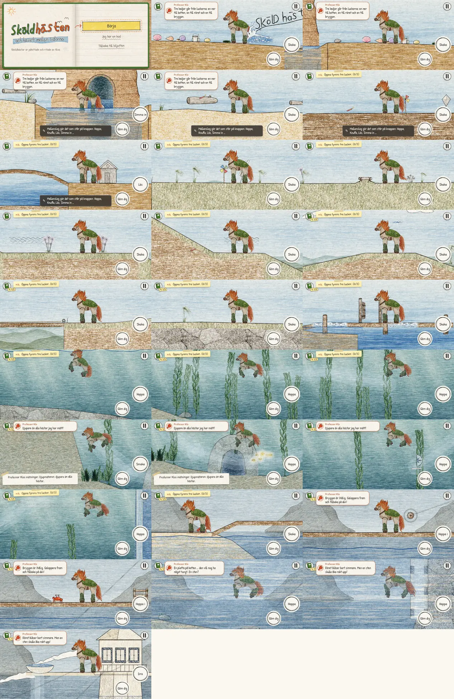
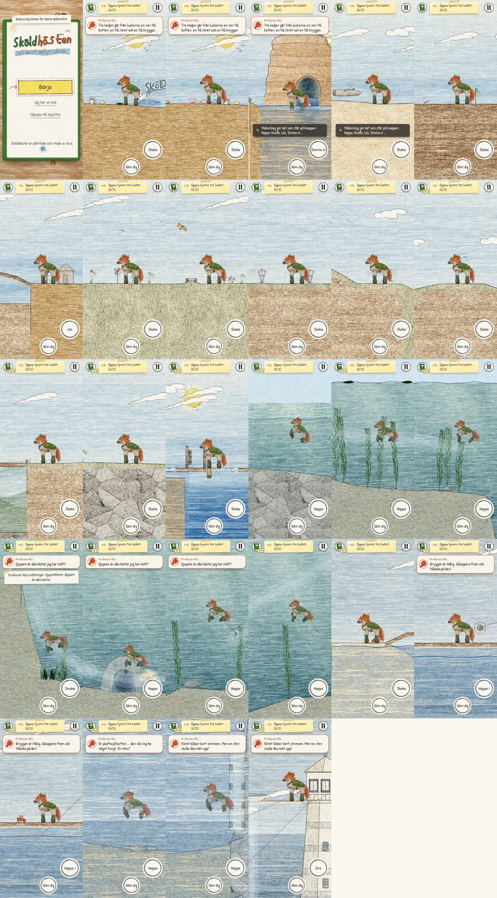
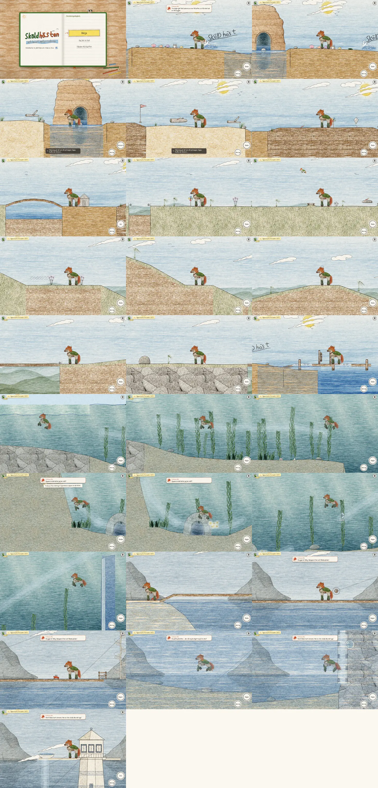

# Polish review — 29 September 2026

Base: `main` at `1af945b`. Working branch: `codex/skoldhast-polish`.
Before implementation: `npm test` passed all 27 tests, including the whole-game robot.
All 27 places plus the title were captured at each requested viewport, then inspected.

## Before findings and implementation plan

| Area | Observed issue | Planned correction |
| --- | --- | --- |
| Klo | Whole-sprite pose swaps, no independent blink or leg cycle; hole entry teleports; no crab interaction. | Separate pencil parts, eased scuttle and gestures, guarded tap/K interaction, shuffled Swedish lines. |
| Audio | Pier shares plank voice; voices ignore voice slider; bright repetitive effects, generic land wind, missing menu cues. | Warmer arrangements, distinct surfaces, location ambience, isolated buses, offline signal checks. |
| Hills | Overlapping ramp polygons cover terrace materials/outlines; fixed-length vertical lines do not follow actual cliff joins; two low ramp ends miss the underlying path. | Shared visible terrain contour and exact endpoints; capture the same hill positions before/after. |
| Running | `floorAt` uses an impossible support range, canceling horizontal free hops; hurdle landing is not sampled from terrain; slope speed thresholds jump. | Repair queries, continuous slope response, grounded landing tests and deterministic replay. |
| Swimming | Phase depends on instantaneous speed, so paddles can pop; no distinct dive; shadow mixes local and world coordinates. | Persistent stroke phase, world-coordinate rig tests, floating hair and surface/dive poses. |
| Puzzles/UI | Action labels can switch around speed/proximity thresholds; optional toy coverage incomplete; menu sounds absent. | Stable context selection, deterministic boardwalk notes, full accelerated DOM-input playthrough and extras. |
| Scenery | Dense repeated material bands; ridges hidden behind foreground; underwater shafts weak; bay lacks evening art. | Restrained pencil shading, visible depth, bounded light strokes and warmer evening reflections. |

The baseline tours use a chapter word code and teleport to review compositions; they are not fresh playthroughs.
Separate accelerated fresh-save keyboard/touch routes will check puzzle progression, and existing browser checks cover actual rendering and touch dispatch.
Software Chromium cannot establish performance on a physical phone.

## Before contact sheets

## Acceptance evidence

To be filled after implementation: tests, browser matrix, audio measurements, payload size, after comparisons and remaining checks.
