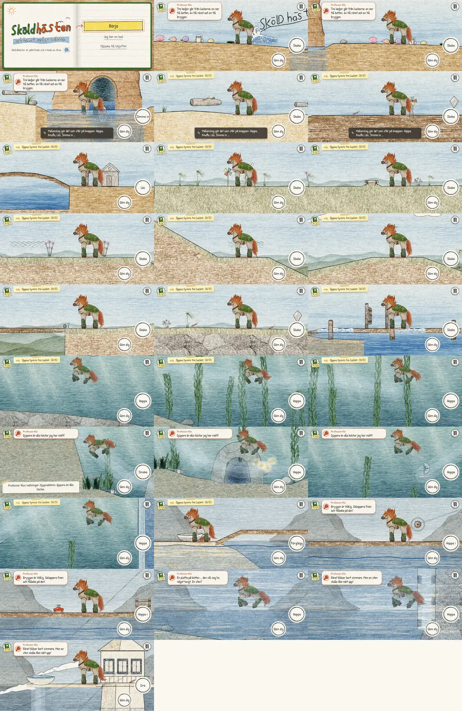
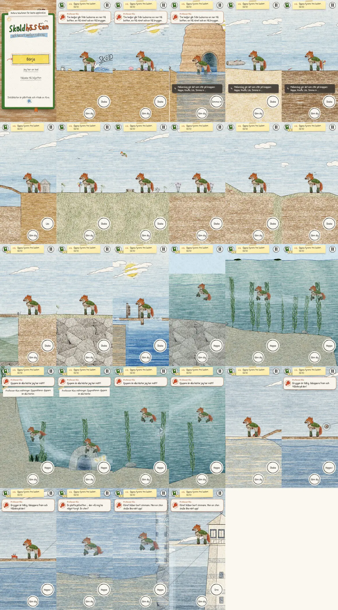
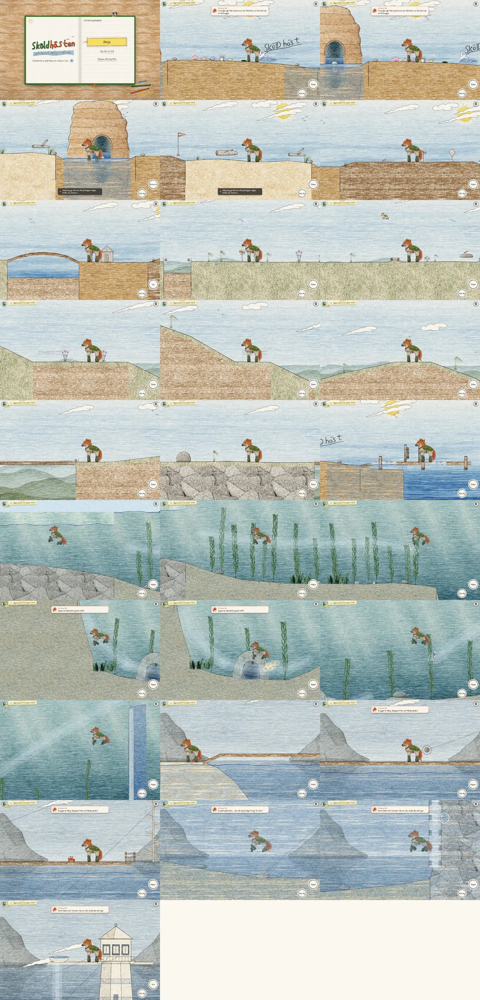
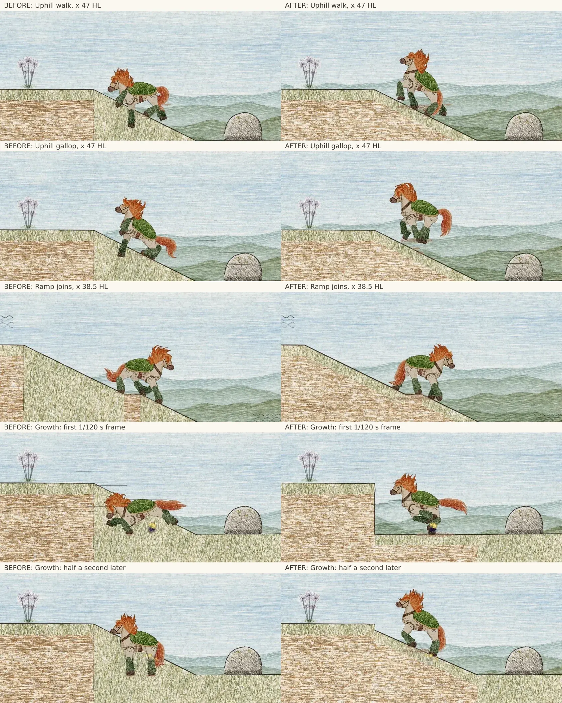

# Polish review — 29 September 2026

Base: `main` at `1af945b`. Working branch: `codex/skoldhast-polish`.
Before implementation: `npm test` passed all 27 tests, including the whole-game robot.
All 27 places plus the title were captured at each requested viewport, then inspected.

## Before findings and implementation plan

| Area | Observed issue | Planned correction |
| --- | --- | --- |
| Klo | Whole-sprite pose swaps, no independent blink or leg cycle; hole entry teleports; no crab interaction. | Separate pencil parts, eased scuttle and gestures, guarded tap/K interaction, shuffled Swedish lines. |
| Audio | Pier shares plank voice; voices ignore voice slider; bright repetitive effects, generic land wind, missing menu cues. | Warmer arrangements, distinct surfaces, location ambience, isolated buses, offline signal checks. |
| Hills | Overlapping ramp polygons cover terrace materials/outlines; fixed-length vertical lines do not follow actual cliff joins; two low ramp ends miss the underlying path. | Shared visible terrain contour and exact endpoints; capture the same hill positions before/after. |
| Running | `floorAt` uses an impossible support range, canceling horizontal free hops; hurdle landing is not sampled from terrain; slope speed thresholds jump. | Repair queries, continuous slope response, grounded landing tests and deterministic replay. |
| Swimming | Phase depends on instantaneous speed, so paddles can pop; no distinct dive; shadow mixes local and world coordinates. | Persistent stroke phase, world-coordinate rig tests, floating hair and surface/dive poses. |
| Puzzles/UI | Action labels can switch around speed/proximity thresholds; optional toy coverage incomplete; menu sounds absent. | Stable context selection, deterministic boardwalk notes, full accelerated DOM-input playthrough and extras. |
| Scenery | Dense repeated material bands; ridges hidden behind foreground; underwater shafts weak; bay lacks evening art. | Restrained pencil shading, visible depth, bounded light strokes and warmer evening reflections. |

The baseline tours use a chapter word code and teleport to review compositions; they are not fresh playthroughs.
Separate accelerated fresh-save keyboard/touch routes will check puzzle progression, and existing browser checks cover actual rendering and touch dispatch.
Software Chromium cannot establish performance on a physical phone.

## Before contact sheets

## Acceptance evidence

- Final pure suite: 66 passing tests including the whole-game robot, deterministic movement/growth, rig coordinates, terrain contours, audio signals, contextual puzzles, Klo and retained action presses.
- Required launch, save/continue, guide, page-turn and finale browser checks pass. Standard touch checks pass at both phone sizes. The Klo follow-finger checks pass at both phone sizes. Four fresh journey variants cover both input modes and orientations; see the focused puzzle report.
- Audio: 60 scenes/cues and 79 pitch notes rendered through Chromium OfflineAudioContext. Zero clipped/non-finite samples; worst sample peak −1.72 dBFS, true peak −1.5 dBFS; muted bus isolation below −100 dBFS. See [audio results](audio-polish.md) and `audio-qa.json`.
- First playable: 2.58 MiB (about 2.709 MB including compressed source, CSS and JSON), below 3 MB. No downloaded audio, heavy filter or photo/scan was added.
- All 27 stops captured at 844×390, 390×844 and 1440×900. Every sheet was compared with its baseline. The [scenery review](scenery-polish.md) records composition, materials, water, evening and underwater findings.
- The [hill review](hills-review.md) includes 28 matching before/after captures and four actual simulated walk/gallop routes. No support mismatch, unintentional airborne steps or console errors. Ramp growth starts with a 0.059-unit rise and stays at or below 2.31 units per step in the measured case.

## Critical comparison and remaining checks

The ground no longer switches abruptly between vertical grass-filled polygons and earth at overlapping ramp edges. Its pencil outline follows the same exposed contour as collision. Uphill planted feet remain on that contour. The slow-growth comparison shows the player rising with the ramp instead of jumping to its final height.

Landscape and desktop have more legible distant ridges and softer earth hatching. Portrait retains the hero silhouette and usable controls. Water now has restrained moving pencil highlights; evening beach/bay have a warm reflection path. Underwater has clearer light shafts and distant silhouettes. Foreground kelp can still briefly overlap/soften the hero; no new terrain holes or missing scenes were found.

The fresh touch route also exposed an off-screen cloud drawing in the portrait prologue; its paper coordinates are now scaled correctly. Follow-finger taps on Klo defer steering so camera lead cannot move him away before release. Menus drop pending movement and action edges, and display frames faster than 120 Hz retain actions until a simulation step. Hold-to-hide releases cancel pending tucks, and a paused game can close and reopen without remaining frozen.

These are automated browser/simulation checks and visual inspections, not a physical-phone benchmark or a human listening test. Device frame pacing, subjective gait/swimming feel and speaker/headphone balance remain for the family device. Optional design items that were already absent (Flytbryggan and additional chapter pencils) remain outside this polish pass.

## After contact sheets

## Exact hill comparison

