# One stuck wave, one waterline, and Klo's first sight

Review notes for the continuation on `codex/skoldhast-living-opening`, on top of
`dfc1c6d`. Pappa played the opening and the first beach and saw that the water,
the wave and the shoreline did not line up. Each image shows the same moment
before (left, `dfc1c6d`) and after (right).

## What was wrong, and why

| Seen | Cause |
| --- | --- |
| A grey box with a straight blue line cut into the sand, in her picture and on the playable beach | The shallows' water box started 1.2 HL up the beach (`x0` 110.4, where the sand is still 34 units above the sea). The surface line and the tint were drawn over dry sand. |
| The splash stood on dry sand, far from the sea | The frozen splash is a wave running in from the right, but no water reached it: the sea began 2 HL away. |
| In the margin, a rectangle of sea with straight edges by the tower | The painted margin was a block of bands with a ruled top and bottom, unrelated to her picture's colours or its beach. |
| The shoreline dots floated below the beach's end | They used the beach's last point minus 6 units; the sea level is 7 paper units higher. |
| The shell accent's dots sat above the plates, and the result was a jagged line | Five fixed offsets, not the shell's own rim; the pigment was a polyline through them. |
| A grey-brown smear under the hooves | The ground shadow was centred on the ground line, so half of it lay over the sea behind the beach. |
| A dark green blob under the tail | The seaweed strand was placed at the hind hooves. |
| The wave just stopped when the paper folded | Its scale and drops were cut on one frame. |
| At the jetty, the page ended in a vertical wall of backdrop | The seabed and the sea stopped at 114.7–114.9 HL, before the page edge. |
| In Viken the waterline ran over the shore sand and the lighthouse rock | The same box-shaped water, from the scene's left edge. |

## What changed

- `src/stuck-wave.mjs` draws the splash with its run-up: a sheet of water from
  the exact point where the sand meets the sea level up to the hooves. Its crest
  meets the sea's surface line tangentially. The opening and the beach share it.
- In the opening the stamp calls the wave: it runs up from the waterline and
  bursts as the hoof lands. At the fold it slows to a halt over 0.6 s, cools
  slightly and glints along its edge. (A first version traced a grey graphite
  outline; Pappa asked what the grey line was, and it was removed: her foam is
  already outlined in its own dark-blue pencil.) The beach keeps that exact
  frozen moment.
- `seaSpans` (view): an open-sky sea is drawn only where the ground dips below
  it, and its veil follows the bed. A drawn-only `tail` carries the shallows bed
  under the jetty. Collision is unchanged.
- The margin rows take the picture's own edge colour and thin out, the sand and
  seabed follow the world's bed, kelp stands on a shelf, the tower on an islet.
- The shell dots come from the live shell sprite's rim; the shore dots start at
  the wave's crest on the sea level. Both strokes are drawn as pencil lines.
- Ground shadow seated on the sand; seaweed moved into the shallows.

## Second round: the water in her pencil, and Klo's wonder

Pappa: the wave looked right but its water did not match the sea around it,
and Klo "just appears". Five independent designs (three for Klo, two for the
water) were compared by two judges, who checked every claim against the code.

**Water.**

| Seen | Cause | Now |
| --- | --- | --- |
| The run-up looked smoother and flatter than the splash | A procedural fill imitated her hatching | `frozen-runup` is drawn by the art pipeline with the splash's own helpers (`foamCrest`, `waterHatch`, loops) on the shared shape in `src/stuck-wave-shape.mjs`; its hatching turns into her sea's level strokes near the shore |
| In play the wave stood against sky | `bg-beach` is fitted to the screen, and its sea (73 % down) sank below the sand | the sea row is pinned to the world (`seaRow`, `seaY`), exactly where her picture already had it; an underlay covers the screen's bottom edge |
| The sand's edge was graphite | every terrain line was graphite | her dark-blue waterline (§2.3) runs from 105.25 HL to the shore and on into the sea line |
| A pebble cut the waterline at the shore | it was drawn in front of the wave | it lies behind it |
| Solid blue dots in the shallows' foam | `foam-edge` filled its holes | the holes are paper-white loops outlined in dark blue |
| A tinted box under the mirror pool | the pool's water went down to the page bottom | it follows its bed like the sea |

**Klo.** He used to pop out in 2.7 s and read his notebook without looking at
the horse. Now, after her question "Häst eller sköldpadda? Ingen vet. Det behövs
en forskare!" (the plan's own caption, never shown before), he comes up in the
dry sand behind the horse: a drop from the shell lands in his hole; his stalks
peek, look the wrong way, climb hoof → leg → shell; he floats up open-mouthed,
drops his notebook, stars twinkle, a pencil "?" appears: *"Oj … vilket skal! En
jättesköldpadda?"* The horse tosses its head; both eyes follow the mane; the
horse stamps and the eyes whip between hooves and mane; one eye on each half;
crouch; leap with "!"; he snatches up the notebook and scribbles as he scuttles
over: *"Man och hovar?! Som en häst! Det här måste undersökas – från man till
hov!"* After the cloud he remembers his manners: *"Förlåt! Forskaren är här:
Professor Klo – expert på land och vatten." "Hittills mest krabbor."* The camera
pushes in on his scene (on phones he grows from about 36 to 62 px). Eye aims are
measured from the drawn pupils; from behind the horse only "up" (shell, mane)
and "down" (hooves) read, so the gag uses those. The direct question and the
horse's "Ja." stay in Kapitel 1.

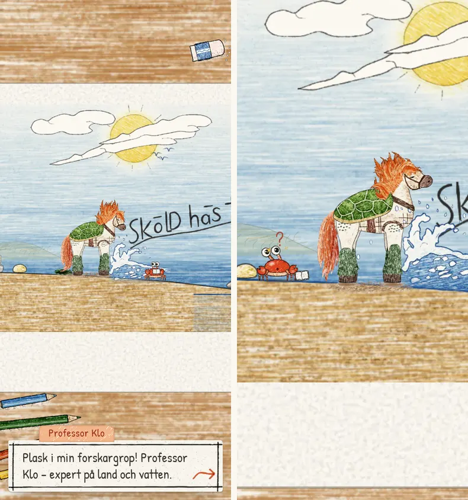
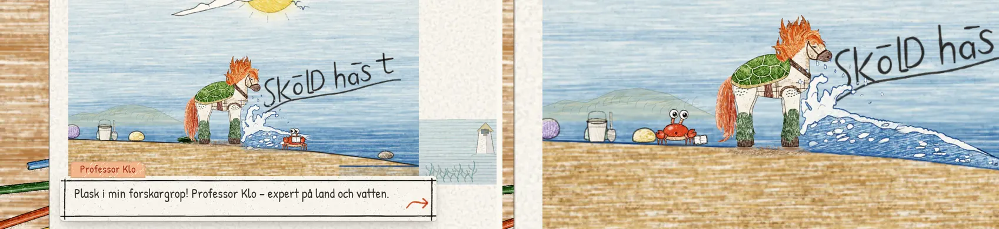
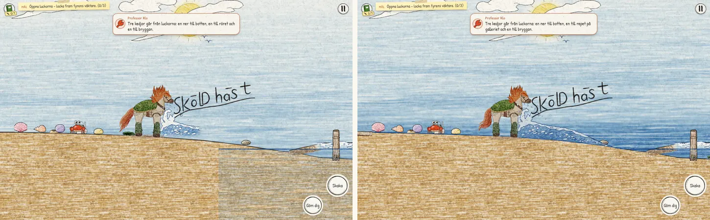

## Before and after

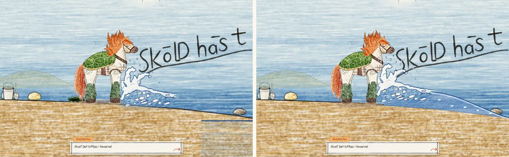
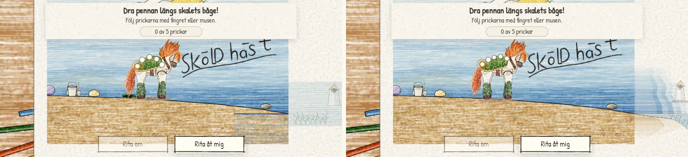
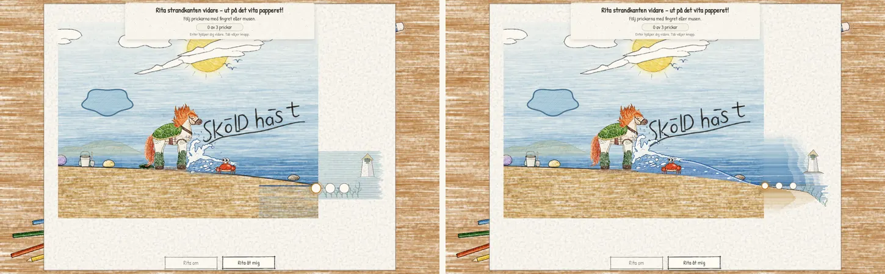
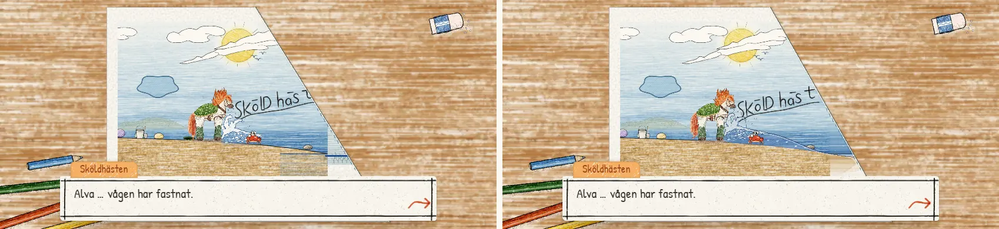
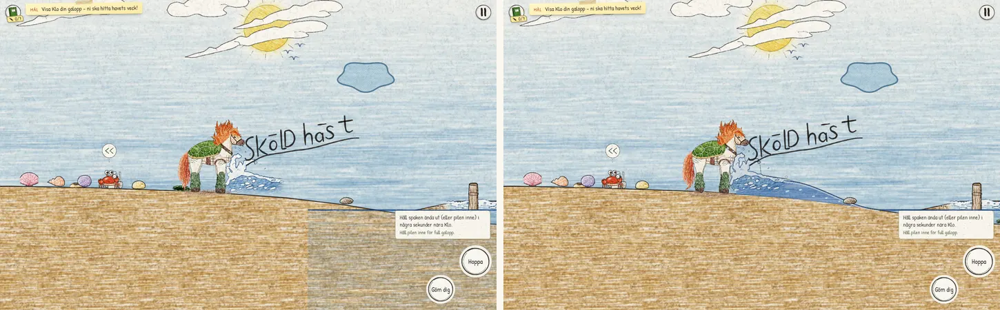
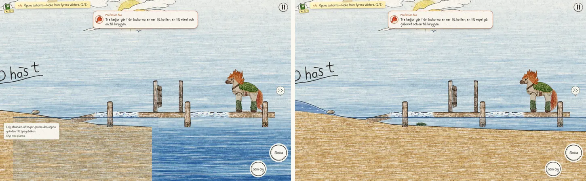
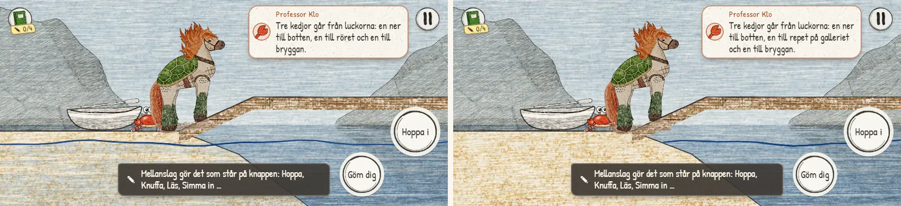

The refreshed 27-place contact sheets are `shots/k3/sheet-*.webp`.

## Third round: the drop in slow motion (30 September)

Pappa asked for a longer, more dramatic entrance in which the water drop from
the sköldhäst to the sand is what wakes Klo, in slow motion. The shake slows
time to 15 %; the camera follows one drop off the shell (a glint at the top of
its flight, a pencil trail, its shadow tightening on the sand), two smaller
drops land short, and the big one lands in slow motion with a crown, a jet and
wet sand. Time snaps back; Klo's stalks rise with closed eyes that pop open;
the camera pulls back as he rises (slowed to 45 %) with sand pouring off his
shell. Reduced motion keeps every beat at normal speed and without camera moves.

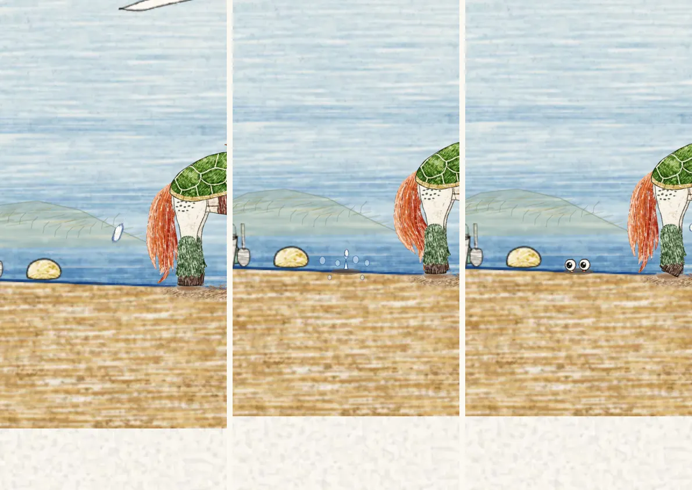
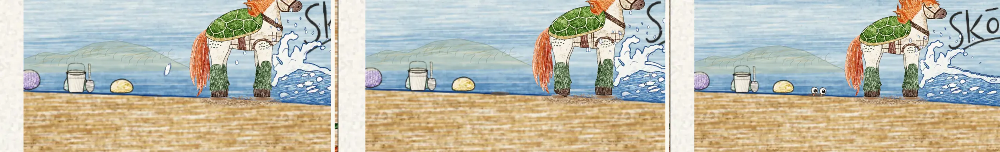

Also: the dunes' sand and the pool's wet sand now blend instead of meeting in a
vertical seam, and `mat-glass` (unused) left the first download (2,783,057
bytes). Pure suite 158/158; all 17 browser checks pass one at a time, including
a prologue-lifecycle check that closes the game while the drop falls, during
the whisper and during the leap.

## Verification

- `npm test`: 150/150, the full-game robot included. New pure tests: Klo's
  staged entrance (stage order, continuity, dry-sand x range, the flat notebook,
  reduced motion), the hand-off spot, `clipX`, and the stuck wave's shape (shore
  point, crest continuity, the drawn run-up's size matching the beach data, and
  her sea at the same height in play as in her picture).
- Browser checks pass on the final code, one at a time: awakening (touch and
  keyboard at both phone sizes, reduced motion; her caption before Klo, three
  boxes before the first drawing, "?" held during the whisper, "!" at the leap),
  opening (both sizes and reduced motion), water alignment (her blue waterline
  from 105.25 HL into the sea line, on the sand), prologue lifecycle, lifecycle,
  launch, save, touch, guide, pages, finale, cloud colour, cloud sky, fold demo,
  view lifecycle, context recovery and notebook. No browser errors.
- Three checks waited for the opening's old first caption and were repaired to
  go through the real shell stroke (prologue lifecycle, lifecycle); the water
  check now allows waterlines that end where the ground meets the sea.
- `pages` and `water-alignment` each failed once while other browser runs
  overlapped; both pass alone, repeatedly.
- `node scripts/build-skoldhast-assets.mjs --check`: first playable 2,815,239
  bytes (`klo-part-body-o` +1.7 KB, `frozen-runup` +16 KB). The build wrote
  `src\…` paths into `files.json` on Windows; it now always writes URL slashes.
  Rebuilding `props` changes only `props-land` and the `foam-edge` frame (plus a
  few lossy-compression pixels in its two neighbours).

Not verifiable here: whether a ten-year-old laughs at Klo's double take and reads
"turtle or horse?" from it, how the wave's halt reads, and frame pacing on a
physical phone.
